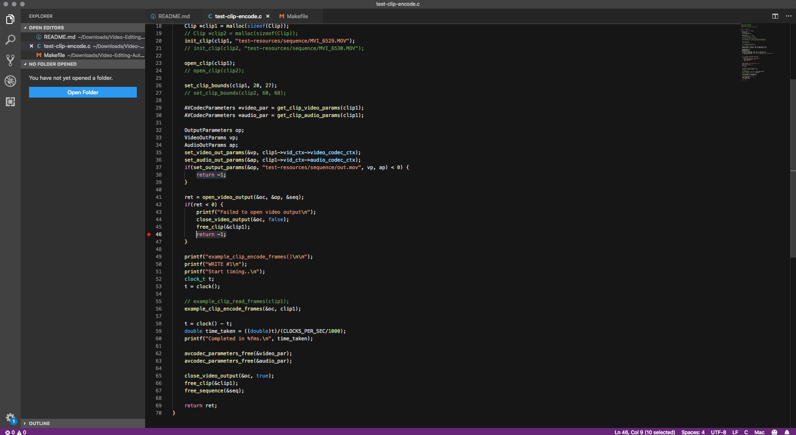
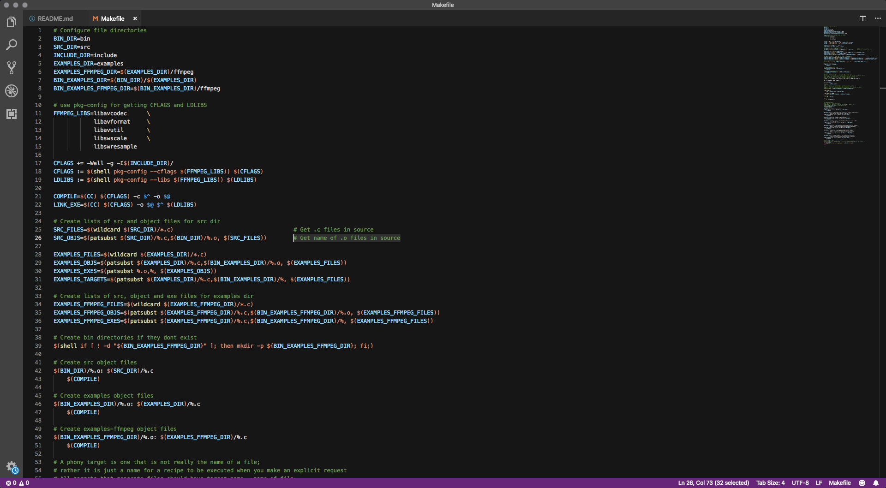

# Material UI for Visual Studio Code

**Screenshots:**

This theme is pretty cut and dry: it brings the great colour palette of Material UI to Visual Studio Code and makes it look even better than before!

**Install:** You can install the extension from three places
> - [Download a release from GitHub](https://github.com/doamatto/materialui-vscode/releases/latest)
> - [Self-Package the Source via GitHub](https://github.com/doamatto/materialui-vscode)
> - [Install from the Visual Studio Marketplace](https://marketplace.visualstudio.com/items?itemName=doamatto.materialui-vscode)
